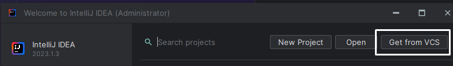
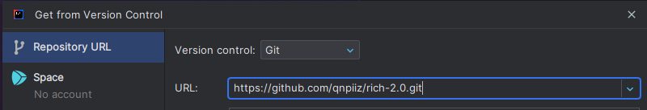
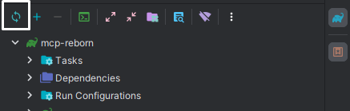
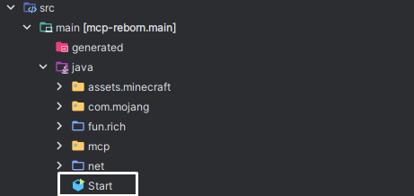
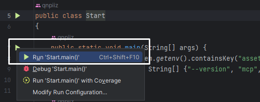

# Rich 2.0
SDK (база, основа) rich client на версию 1.16.5

---

База rich client является самой распространненой среди коммьюнити yougame, пастеров и других. К данной базе думаю начинали многие, но с массовым переходом всех на 1.16.5 эту базу убило. Поэтому я решил создать базу рича на основе 1.16.5

## Перечень изменений
Из-за новой системы рендеринга на версии 1.16.5 и моей лени произошли следующие изменения:
* К каждому методу отрисовки шрифтов и RenderUtils в конце добавлен параметр **MatrixStack**
* **Убрал поиск** в кликгуи, **potato mode** и **аниме картинки**
* `Rich.instance.` name, type, version были заменены на `Rich.` NAME, VERSION
* Нету многих функций, альт менеджера, **конечно всё это будет, но через определённое время**

## Как использовать?
1. Откройте главное меню **Intellij Idea** и нажмите `Get From VCS`:

2. В **URL** вставьте следующую ссылку: `https://github.com/qnpiiz/rich-2.0.git`

3. Нажмите на кнопку `Clone`
4. Справа выберите черепашку и нажмите на иконку **перезагрузки**:

5. Откройте src/main/java/Start и нажмите на **зеленую стрелочку**:

6. Наслаждаемся клиентом

Скриншот:

